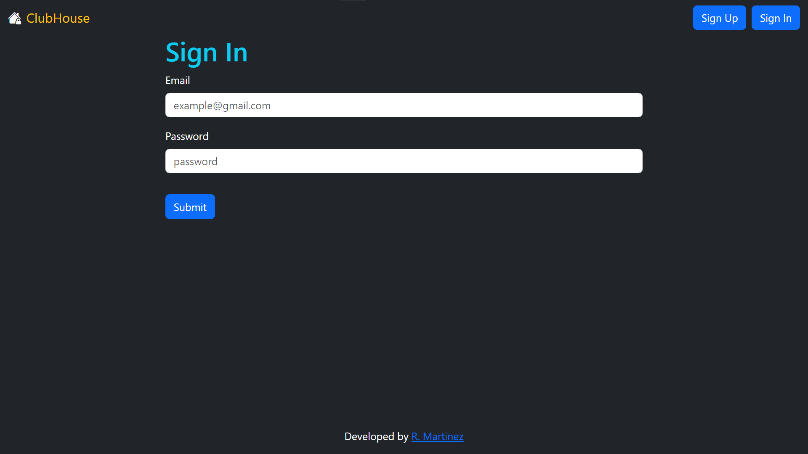
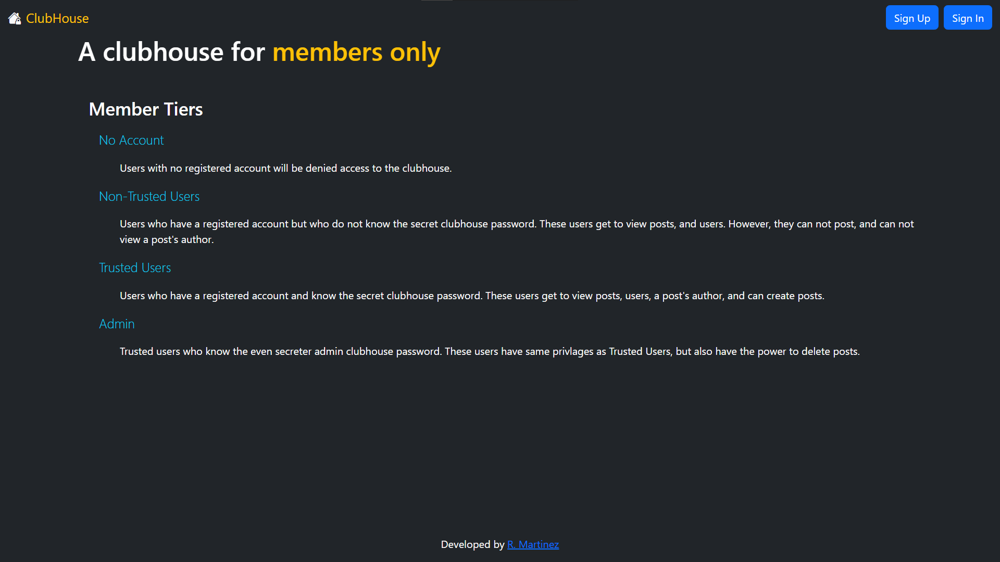
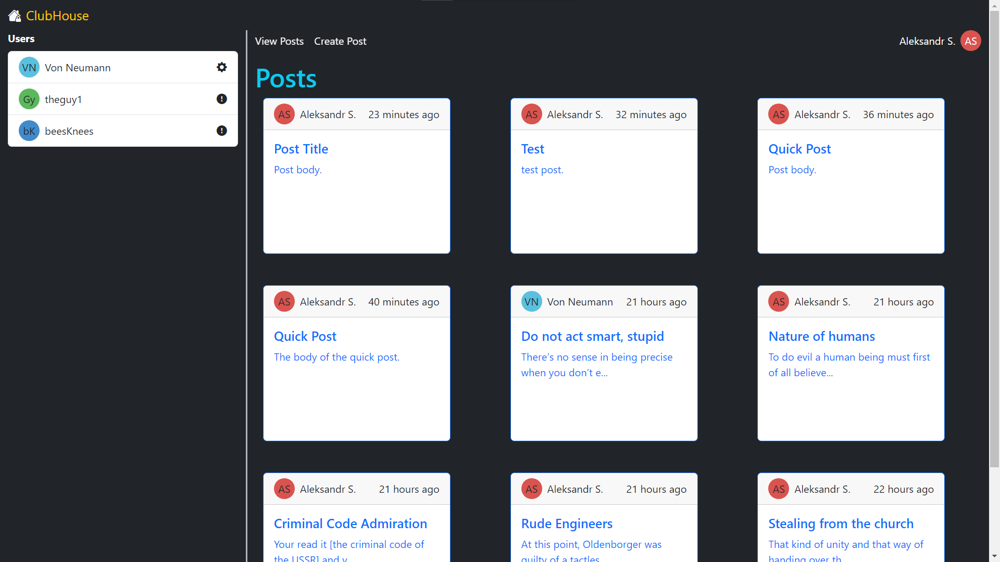
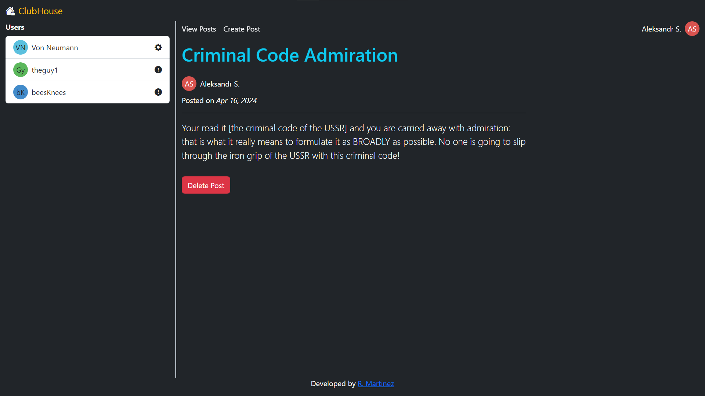
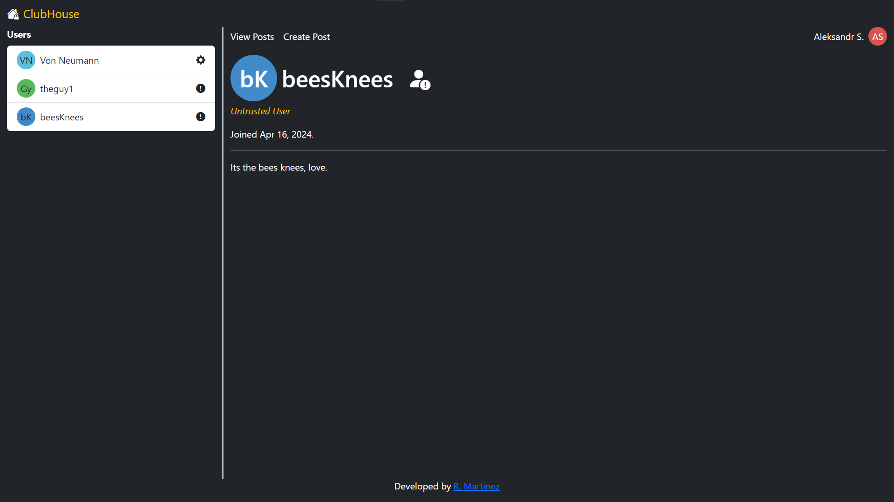
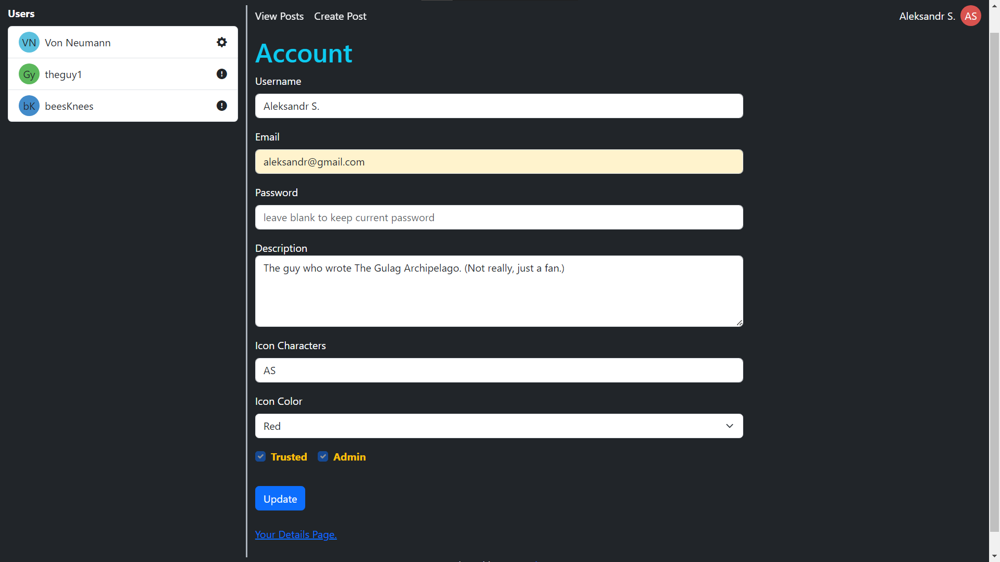

# Clubhouse (social media website / twitter clone)

What is this project? Its a twitter clone with a clubhouse theme. Its also a fullstack application.

**Live demo [link](https://clubhouse-97e9bb211e66.herokuapp.com/clubhouse/rules)**. 👈

### Technology Used

- ExpressJS
- NodeJS
- PassportJS
- Heroku
- Bootstrap
- HTML/CSS
- Pug

# Screenshots

# Commands

To start up the local development server: `npm run devstart`
